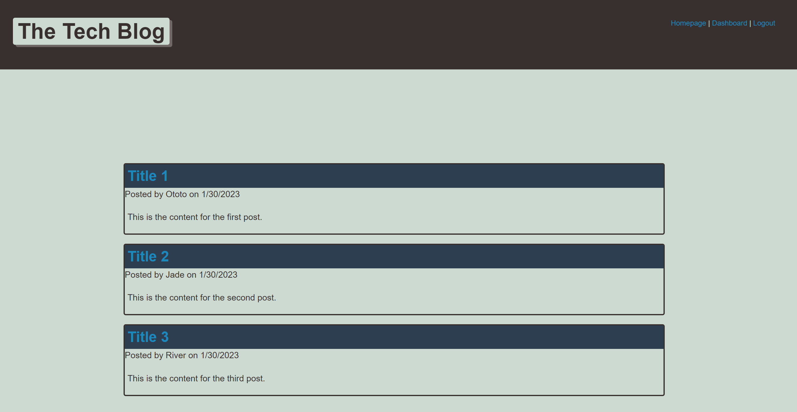

# MVC
Challenge #14: MVC

This challenge was to create a tech blog that has multipule users, blog posts, and comments. Functionality should include being able to create a new account, create new posts, create new comments, edit/delete existing posts, and log in and out.

Link: https://tech-blog-mdinkelbach.herokuapp.com/